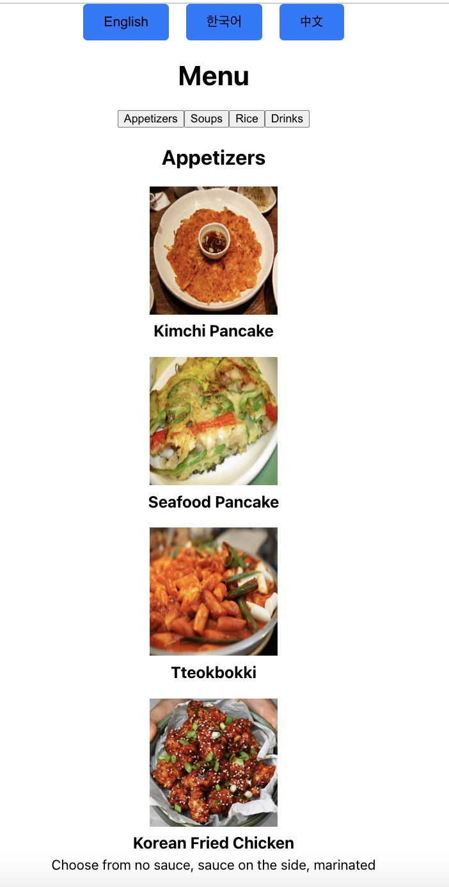

# Sol's on the Square

Webpage demo as of 2024-02-09: https://www.loom.com/share/afac0a0246ca4086afa96dfea17f63a5?sid=f180fc66-d9c8-4cdb-baf8-b25106c4fd4f
* Added a **cart** feature
* Added Google Review Promotion
  
## Overview

Sol's on the Square is a beloved Korean restaurant in Madison, Wisconsin. Noticing that their paper menus lacked images and didn't cater to the linguistic needs of their significant Chinese clientele, I decided to lend a hand. As a friend of the owner and eager to hone my React skills, I developed this website to enhance the dining experience for all patrons.

## Features

- **Multi-language Support**: Seamlessly switch between English, Korean, and Chinese to accommodate our diverse clientele.
- **Smooth Scrolling Navigation**: Effortlessly browse through our menu categories, including appetizers, soups, rice dishes, and drinks, with smooth scrolling.
- **Responsive Design**: Enjoy a flawless browsing experience on any device, whether it’s a desktop, tablet, or smartphone.

<div align="center">
  
  
  
</div>

## Getting Started

To run "Sol's on the Square" locally, follow these steps:

1. Clone the repository:

```
git clone https://github.com/yourusername/sols-on-the-square.git
```

2. Navigate to the project directory:

```
cd sols-on-the-square
```

3. Install dependencies:

```
npm install
```

4. Start the development server:

```
npm run start
```

The website should now be accessible at `http://localhost:3000`.

## Contributing

If you have suggestions for improvements or have identified a bug, please open an issue to discuss it. Should you wish to contribute code, kindly fork the repository and submit a pull request with your changes!

## License

This project is licensed under the MIT License. See the [LICENSE](LICENSE) file for more details.
